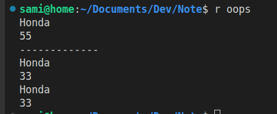
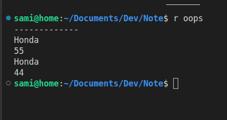

## Class & Object

A class is like a blueprint basically a template. An object is an instances of that class. An class contains variables and methods(function) to describe the object. 

On below there is an example of class and object.

```cpp
#include <iostream>
using namespace std;

class Car {
private:
    int speed;

public:
    string brand;

    Car(string b, int s) {
        brand = b;
        speed = s;
    }

    void drive() {
        cout << brand << " going at " << speed << " km/h" << endl;
    }
};

int main() {
    Car car1("Toyota", 120);
    Car car2("BMW", 200);

    car1.drive();   // Toyota going at 120 km/h
    car2.drive();   // BMW going at 200 km/h
}
```

> Here Car is the class and Car1 and Car2 are the object. Again here, speed and  brand are attribute and drive are the method 


## Access Modifier 

 Access modifier controls who can get access to the data (variables) and methods(function)

**In C++ there are 3 access modifier**


- Public 
- Private
- Protected

*By default, everything is private in C++*


### Access Modifier's Comparison  Chart

| Modifier  | Same Class | Derived Class | Outside Class |
| --------- | ---------- | ------------- | ------------- |
| Public    |  Yes      |  Yes         |  Yes         |
| Protected |  Yes      |  Yes         |  No          |
| Private   |  Yes      |  No          |  No          |

### To easily Remember

- Public (Open to all)
- Private (Only me / Open to only same class)
- Protected (Family Only / me + inherited class )


### Four Big Topics in OOPS

- Encapsulation
- Abstraction
- Inheritance
- Polymorphism

## Encapsulation
> Encapsualtion is wrapping up of data and member function into a single unit called class and exposes only what's needed

- In easy word, it hide data and control how it is used

### Bank Account Example

```cpp
#include<bits/stdc++.h>
using namespace std;

class BankAccount{
private:
    int balance;

public:
    BankAccount(int amount){
        balance = amount;
    }
    int GetBalance(){
        return this->balance;
    }
    void withdraw(int amount){
        if(amount <= 0){
            cout << "Invalid Amount" << endl;
        }
        else if(amount > balance){
            cout << "Insufficient Balance" << endl;
        }
        else{
            balance -= amount;
        }

    }

    void deposit(int amount){
        if(amount <= 0){
            cout << "Invalid amount " << endl;
        }
        else{
            balance += amount;
        }
    }


};


int main(){
    BankAccount A1(400);
    cout << A1.GetBalance() << endl; // Output :400
    A1.deposit(-300); // Output :Invalid amount
    A1.deposit(450); 
    A1.withdraw(6000); // // Output : Insufficient Balance
    cout << A1.GetBalance() << endl; // // Output : 850
}
```
> how encapsulation is different from access modifier ?
- Encapsulation = concept (idea)
- Access Modifiers = tools (how you implement it)
- Encapsulation tells the concept - Hide data + control access
- Access Modifiers is the tools by which we acheive it; (private, public, protected) → by which we achieve it
> We often use getter and setter to access and change value of private data. Here is an example


```cpp
#include<bits/stdc++.h>
using namespace std;

class Marks{
private:
    int mark;
public: 
    void setMark(int p){
        if(p >= 0){
            mark = p;
        }
    }
    int getMark(){
        return mark;
    }
};


int main(){
   Marks m1;
   m1.setMark(45);
   cout << m1.getMark() << endl; // Output :45
}
```

## Constructor
> A constructor is a special method function which is automatically called while object creation.

**Characteristics of Constructor**
- It has same name as class
- No return type (Not even void)
- Only called **once**(automatically while object creation)
- If we create one or many custom constructor, then we have to use one of those custom constructor. We can't use default constructor anymore.
- Constructor creation happens only when an object is called

***Here is an example of constructor***
```cpp
class Car {
private:
    int speed;

public:
    string brand;

    Car(){

    }
    Car(string b){
        brand = b;
    }

    Car(string b, int s) {
        brand = b;
        speed = s;
    }

    
};
```
> On the above example, there are 3 constructor. They are different only in taking input values. These stuff is known as construction overloading 

## This Pointer
> This is an implicit(hidden) pointer that is automatically available and it points to the current object that is calling the function

```cpp
class Car {
private:
    string name;
    int speed;

public:
    void setName(string name) {   // same name as member!
        this->name = name;        // this->name = member, name = parameter
    }

    void setSpeed(int speed) {    // same name as member!
        this->speed = speed;
    }
};
```
Now here if we don't use this , compiler can't distinguish between parameter and member data, 

```cpp
void setName(string name) {
    name = name;  // what comiler do, parameter = parameter , happens nothing
}
```
## Copy Constructor

> Copy constructor is a special type of constructor that copies from one object thing to another object

Now there is a default copy constructor in C++ which use shallow copying. 

`Student S2(S1); ` // Here , this is how default constructor can be called.All values of s2 will be assigned same as S1;

Two types of copy constructor: 
- Shallow Copy 
- Deep Copy 
#### Shallow Copy 
> Shallow copy is fine for regular variables as it copies its value. But problem arises , when it is used on a pointer variables, as it copies only the address. Because , this copies only the address , both object share the same locations. Changing one variables value will change another variables value . In case of deleting one memory address, other pointer will point to a variable that does not even exist. 

Lets see an example: 

```cpp
#include<bits/stdc++.h>
using namespace std;

class Car{
public:
    string brandName;
    int *tiresize;

    Car(string b, int *p){
        brandName = b;
        tiresize = p;
    }
    void getinfo(){
        cout << this->brandName << endl;
        cout << *this->tiresize << endl;
    }
};

int main(){
    int a = 55;
    Car Car1("Honda", &a);
    Car1.getinfo(); 
    Car Car2(Car1);
    cout << "-------------" << endl;
    Car1.getinfo();
    Car2.getinfo();
}
```



As we can see Car1's tiresize also changed as both were pointing to the same memory address. Without pointer , this issue don't occur. Now there is something called Deep copy which we can use to solve this issue;

#### Deep Copy 
> Deep copy always copies the value, it never copies the memory address just like Shallow Copy. In pointer , it first create its dynamic memory and then put the value on it . 

```cpp
#include<bits/stdc++.h>
using namespace std;

class Car{
public:
    string brandName;
    int *tiresize;

    Car(string b, int *p){
        brandName = b;
        tiresize = p;
    }
    Car(Car &obj){
        this->brandName = obj.brandName;
        this->tiresize = new int;
        *this->tiresize = *obj.tiresize;
    }
    void getinfo(){
        cout << this->brandName << endl;
        cout << *this->tiresize << endl;
    }
};

int main(){
    int a = 55;
    Car Car1("Honda", &a);
    
    Car Car2(Car1);
    *Car2.tiresize = 44;
    cout << "-------------" << endl;
    Car1.getinfo();
    Car2.getinfo();
}
```

The output : 



Now we have fixed it with deep copy. 

> Please check how to send and receive an object in constructor and function while revision


---
### Polymorphism 

> Polymorphism = “many forms” . In simpler terms, it means the same function name can behave differently depending on the what is calling them.

#### There are two types of Polymorphism 
- Compile Time Polymorphism
- Run Time Polymorphism


#### Compile Time Polymorphism 
- this occurs when the compiler selects the appropriate function at the time of compilation

There are two types of compile time Polymorphism. 
1. Function Overloading 
2. Operator Overloading

#### Function Overloading 
- Same function name but different parameter(different can be made by number of parameter or parameter input type or both)
- Note that , comiler can't differentiate with return type. So, in case function name and parameter is same but return type different , that won't work . 

```cpp
#include<bits/stdc++.h>
using namespace std;

class Car{
public:
    
    void print(int x){
        cout << x << endl;
    }
    void print(double x){
        cout << x << endl;
    }
    void print(string x){
        cout << x << endl;
    }
};

int main(){
    
    Car C1;
    C1.print(10);
    C1.print(10.5);
    C1.print("Honda");

}
```
- Constructor overloading is also one kind of function overloading.

#### Operator Overloading 
- Will Add Soon


> What is the difference between function overloading and function overriding ? 

\- In Same class when we use different function with same name , just with different parameter , we call it function overloading. But when we inheritted any class, if the same function exist in both parent class and child class , we call it function overriding.

#### Runtime Polymorphism 
- Runtime polymorphism occurs only when in the runtime proper function is invoked
we use virtual function to acheive this. 

Let us know the properties of virtual function
1. Virtual function are dynamic in nature
2. It is defined with the keyword "virtual" inside a base class and are always declared with a base class and overridden in a child class. 

Below is an example : 
```cpp
#include<bits/stdc++.h>
using namespace std;

class Car{
public:
    
    virtual void sound(){
        cout << "Peep ! Peep" << endl;
    }
};

class Bike: public Car{
public:
    void sound(){
        cout << "Boom Boom" << endl;
    }
};

int main(){
    Car* ptr;
    Bike B1;
    ptr = &B1;
    ptr->sound();
}
```

Its very easy to worngly understand Runtime Polymorphism , Here is a good answer by Claude : 

### Runtime Polymorphism — Complete Guide

#### 1. What is it?

> A **base class pointer** points to a **derived class object**, and the correct function is called **automatically at runtime.**


#### 2. The 3 Must-Have Ingredients

```
1. virtual keyword in base class
2. override in derived class
3. Base class POINTER pointing to derived object
```
**All 3 are required. Missing even one = not runtime polymorphism.**

---

#### 3. Build It From Scratch

#### ❌ Stage 1 — Plain Overriding (NOT runtime polymorphism)
```cpp
class Car {
public:
    void sound() {                    // no virtual
        cout << "Peep Peep\n";
    }
};

class Bike : public Car {
public:
    void sound() {                    // just overriding
        cout << "Boom Boom\n";
    }
};

int main() {
    Bike B1;
    B1.sound();     // prints "Boom Boom" — but decided at COMPILE time
}                   // NOT runtime polymorphism
```

---

#### ❌ Stage 2 — Added virtual, but wrong pointer
```cpp
class Car {
public:
    virtual void sound() {            // ✅ virtual added
        cout << "Peep Peep\n";
    }
};

class Bike : public Car {
public:
    void sound() {
        cout << "Boom Boom\n";
    }
};

int main() {
    Bike* ptr;                        // ❌ Bike pointer — wrong!
    Bike B1;
    ptr = &B1;
    ptr->sound();   // still compile time — pointer type is Bike*
}
```

---

#### ✅ Stage 3 — All 3 ingredients (CORRECT!)
```cpp
#include<bits/stdc++.h>
using namespace std;

class Car {
public:
    virtual void sound() {            // ✅ ingredient 1: virtual
        cout << "Peep Peep\n";
    }
    virtual ~Car() {}                 // ✅ always add virtual destructor
};

class Bike : public Car {
public:
    void sound() override {           // ✅ ingredient 2: override
        cout << "Boom Boom\n";
    }
};

int main() {
    Car* ptr;                         // ✅ ingredient 3: BASE class pointer
    Bike B1;
    ptr = &B1;                        // base pointer → derived object

    ptr->sound();                     // ✅ RUNTIME decision → "Boom Boom"
}
```

---

#### 4. What Happens Inside — vtable

When you write `virtual`, C++ secretly creates a **vtable** (function lookup table):

```
Car's vtable                Bike's vtable
┌─────────────────┐         ┌─────────────────┐
│ sound() → Car   │         │ sound() → Bike  │
└─────────────────┘         └─────────────────┘

ptr = &B1
        │
        ▼
   Bike object
   vptr ──→ Bike's vtable
              └── sound() → calls Bike::sound() ✅
```
At runtime, `ptr->sound()` follows the `vptr` → finds Bike's vtable → calls `Bike::sound()`.

---

## 5. Real Power — One Pointer, Many Objects

```cpp
int main() {
    Car* ptr;

    Bike B1;
    ptr = &B1;
    ptr->sound();       // "Boom Boom"

    Car C1;
    ptr = &C1;
    ptr->sound();       // "Peep Peep"
}
```

**Same pointer, different objects, different behavior — automatically!**

---

## 6. Ultimate Power — Array of Base Pointers

```cpp
class Car {
public:
    virtual void sound() { cout << "Peep Peep\n"; }
    virtual ~Car(){}
};
class Bike : public Car {
public:
    void sound() override { cout << "Boom Boom\n"; }
};
class Truck : public Car {
public:
    void sound() override { cout << "Honk Honk\n"; }
};
class Bus : public Car {
public:
    void sound() override { cout << "Beep Beep\n"; }
};

int main() {
    Car* garage[4];                // array of base pointers

    garage[0] = new Bike();
    garage[1] = new Truck();
    garage[2] = new Bus();
    garage[3] = new Car();

    for(int i = 0; i < 4; i++) {
        garage[i]->sound();        // each calls its OWN version ✅
    }

    // Output:
    // Boom Boom
    // Honk Honk
    // Beep Beep
    // Peep Peep
}
```
**One loop, one function call — 4 different behaviors. This is the real power!**

---

#### 7. Your Journey Today

```
Attempt 1: no virtual + direct object          ❌ compile time
Attempt 2: virtual  + direct object            ❌ compile time
Attempt 3: virtual  + Bike* ptr = &BikeObj     ❌ compile time
Attempt 4: virtual  + Car*  ptr = &BikeObj     ✅ RUNTIME ← correct!
Attempt 5: virtual  + Bike* ptr = &BikeObj     ❌ went back to attempt 3
```

---

## 8. One Final Rule — Never Forget

```
❌  Derived* ptr = &DerivedObj  →  compile time (same type)
✅  Base*    ptr = &DerivedObj  →  runtime      (different type, virtual)
```

| What you write | Result |
|---|---|
| `Bike B1; B1.sound()` | ❌ Compile time |
| `Bike* ptr = &B1` | ❌ Compile time |
| `Car* ptr = &B1` without virtual | ❌ Compile time (calls Car's version) |
| `Car* ptr = &B1` with virtual | ✅ **Runtime Polymorphism** |